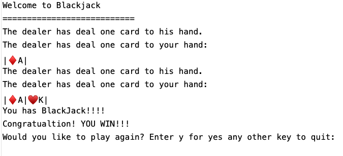
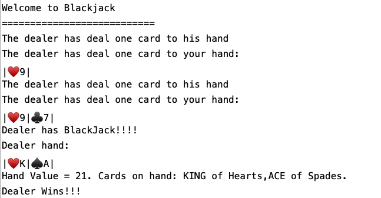
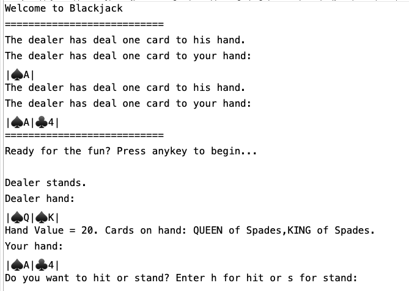
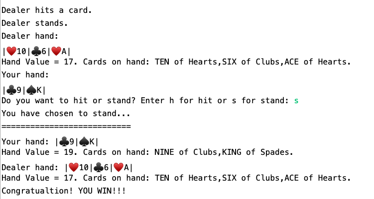
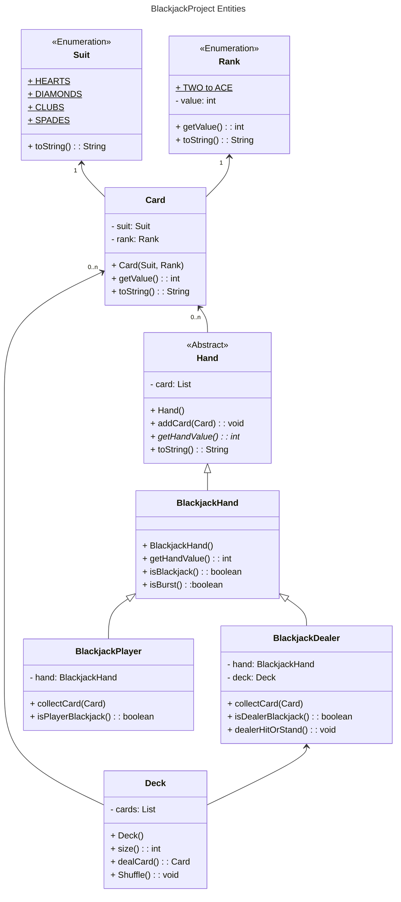

# BlackjackProject

### Description

**When you are feeling lucky... it's Blackjack time!**

Blackjack is a mini text game mimicking casino Blackjack with a dealer and a player. The program was implemented using `enum` class at the lowest abstraction level, the `Suit` and `Rank` of each card. From there, the concept is generalized into a `Card` class, a `Deck` class, and an abstract `Hand` class which is implemented by `BlackjackHand` class and extended to Dealer and Player hands in Blackjack. Each class has private fields and consists of various methods for access and communication. The relationship of these classes are depicted in the following diagram:

In the start, the dealer deals two cards to the player and himself. AAfter that, the dealer has to decide to hit or stand based on the "Rule 17". Once the dealer stands, the player can see the dealer cards and make decisions to hit or stand. The program properly implement the soft value where an Ace can be counted as 1 or 11 based on situations. The program also implements Blackjack situations where an Ace and a ten-value card result in a win with dealer has an upper hand. Since the player can see the dealer hand after the dealer stands, the player has to score higher than the dealer to win the game. In another word, in cases of tie scores, the dealer wins. This program does not implement the case of "Five Card Charlie" where a win is declared for the hand with 5 cards with total scores less than 21.  

I invite you to download and experience this mini-game.

### Tech Used
This project makes use of vanilla Java together with fundamental object-oriented concepts: abstraction, polymorphism,  inheritance, and encapsulation. The projects demonstrates the flexible of several Java data types: `enum`, abstract and concrete class in multi-level of abstraction.    

### Limitations
I have tried to generalize the tasks into each method. However, there are some methods with many code repetitions, especially `Blackjack Dealer` and `BlackjackPlayer` classes. The concept that the dealer IS-A player is not fully utilized. There are also some methods that handle too many things, which makes them hard to be reusable in different context. The code is open for refactoring.
  
### Lessons Learned
Building this game help me reinforce:
- Building classes in an Object-Oriented manner: APIE.
- Building classes whose fields are Objects (has-a).
- Writing methods.
- Using collections to organize and manage data.
- Using conditionals to create game logic.
- Considering common data and behaviors, and refactoring into parent / child classes.

